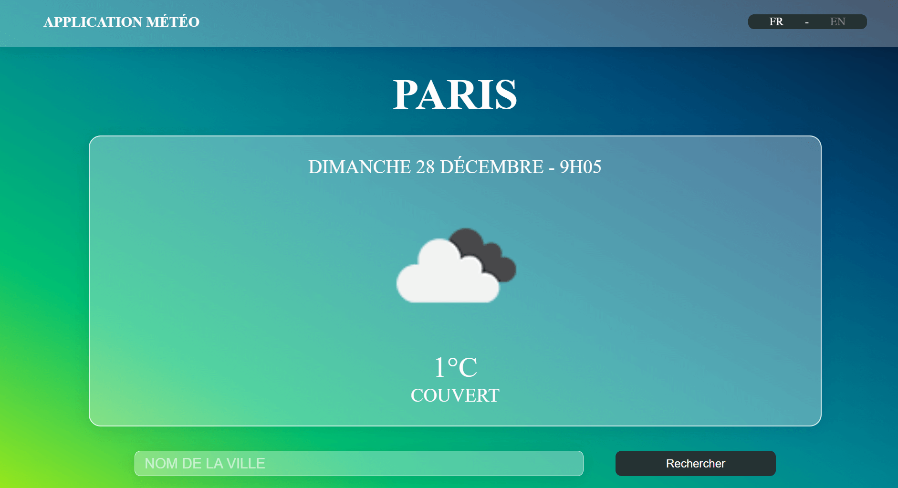

# EasyMeteoLive

Application météo moderne développée avec React 19, permettant de consulter la météo en temps réel pour n'importe quelle ville dans le monde.



## Fonctionnalités

- **Recherche de ville** avec autocomplétion (API GeoNames)
- **Géolocalisation automatique** à la première visite
- **Données météo en temps réel** (OpenWeatherMap API)
- **Heure locale** de la ville affichée (TimeZoneDB API)
- **Multilingue** FR/EN avec formatage adapté (date, heure, unités)
- **Persistance** de la ville et langue (Redux Persist)

## Stack technique

| Technologie | Usage |
|-------------|-------|
| React 19 | UI Components |
| React Query | Data fetching & caching |
| Redux Toolkit | State management |
| Redux Persist | State persistence |
| Axios | API calls |
| Jest | Unit testing |
| Styled Components | CSS-in-JS |
| Vite | Build & dev server |


## Flow de données
- **Première visite :** géolocalisation → GeoNames reverse geocoding → setCity()
- **Visites suivantes :** Redux Persist restaure la ville depuis localStorage
- **Recherche :** useCitySearch() → suggestions → setCity() → useWeather() → affichage

## Points forts
- **Cache intelligent** (React Query : 5-30 min selon les données)
- **Persistance automatique** (ville + langue)
- **Multilingue FR/EN** (UI + API + formatage date/heure)
- **Design glassmorphism**

## Installation

```bash
# Cloner le repo
git clone https://github.com/Christophe-THEVENET/react_meteo_easy.git
cd meteo-easy

# Installer les dépendances
npm install

# Lancer en développement
npm run dev
```

L'application sera accessible sur `http://localhost:5173`

## Configuration des API Keys

Créer un fichier `src/API_KEYS.js` :

```javascript
export const OpenWeather_API_KEY = 'votre_clé_openweathermap'
export const TimeZoneDB_API_KEY = 'votre_clé_timezonedb'
```

Comptes gratuits disponibles sur :
- [OpenWeatherMap](https://openweathermap.org/api)
- [TimeZoneDB](https://timezonedb.com/api)
- [GeoNames](https://www.geonames.org/export/web-services.html)

## Architecture

```
src/
├── Components/
│   ├── Header/      # Navbar + toggle langue
│   ├── Meteo/       # Affichage météo
│   └── CityInput/   # Recherche ville
├── hooks/           # React Query hooks (useWeather, useTimeZone, useCitySearch)
├── redux/           # Store + slices (city, lang)
└── main.jsx         # Providers setup
```

## Tests

```bash
npm test         # Lancer les tests
npm run test:watch  # Mode watch
```

18 tests unitaires couvrant :
- **Redux** : citySlice et langSlice (états, actions)
- **Header** : rendu FR/EN, toggle langue
- **CityInput** : placeholder, recherche, dispatch

## Scripts

```bash
npm run dev      # Serveur de développement
npm run build    # Build production
npm run preview  # Preview du build
npm run lint     # ESLint
npm test         # Tests Jest
```
